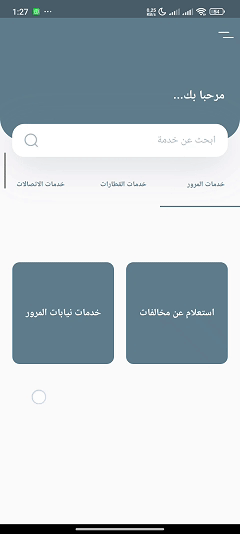
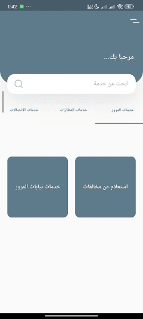
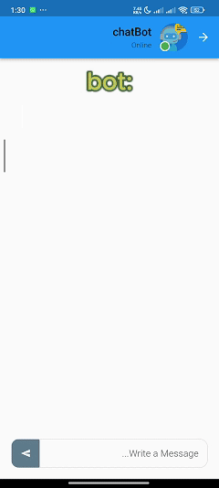
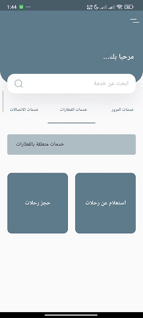

# hackthon-chatbot(Smart Customer Service Platform)
This application won first place in the Smart Government Hackathon competition (smart service - smart community).
This App will focus on developing a conversational AI platform with the goal of providing a smart system that can service multiple government facilities to automate their services in hopes of saving valuable time, money, and manpower, and provide citizens with around the clock assistance.
Developed by Flutter, Firebase and AI Natural Language Wit 

  

## Getting Started

## Features:
1. clean and intuitive UI/UX 
The app uses Firebase Authentication to allow users to create an account and log in. Users can log in using their email and password 

  

2. The customer can know the amount of traffic violations he has to pay through the bot conversation.

  

Another conversation in a different way

  

3. The customer can book a train ticket, specify the starting and arriving station, and know the ticket price through the bot chat.

  

